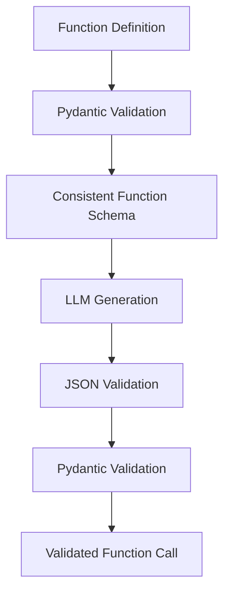

*This project has been created as part of the 42 curriculum by <b>tsitoand</b>*.

<blockquote>
 ... Hey, I just met you, and this is crazy
But here's my number, so
</blockquote>

<div align="center">
  <h1 style="color: #ffffff; font-size:60">call me maybe</h1>
<div align="center">


</div>
</div>


<p align="center">
  
</p>

## Project Description

A **function call** is a mechanism that allows a computer program or an AI model to execute a specific function, tool, or API. In the context of AI, function calling enables a language model to generate structured data that can trigger external actions rather than simply producing plain text.

The goal of this project is to master **constrained decoding** in order to guide a Large Language Model (LLM) and force it to generate valid JSON output for function calls.

For this project, we use **Qwen/Qwen3-0.6B**, a lightweight language model, as the base model.

## Instructions
```shell
# clone the repos
git clone https://github.com/harilecon/call_me_maybe.git
```

before installation assure that you have enougth space `>10Gb`
```shell
# install dependency
make install
```

```shell
# run the programm
make run
```

```shell
# check flake8 and mypy
make lint
```
```shell
# check flake8 and mypy --strict
make lint-strict
```


### Resources
* YouTube videos — Additional video resources related to the project.
* [Hugging Face](https://huggingface.co/) — Resources and models used for the project.
* [Astral UV Documentation](https://docs.astral.sh/uv/) — Learn how to install, use, and understand uv.
* google collab: where i tested my code


#### AI Usage

AI was used to assist with:

* Generating prompts.
* Generating the test structure.
* Writing parts of the README documentation.
* Assisting with function and variable name selection.
* Preparing and organizing the resources section of the README.

### Algorithm Explanation

In Large Language Models (LLMs), Finite State Machines (FSMs) can be used to enforce structural rules during text generation. This process is commonly called Structured Generation, Guided Decoding, or Constrained Decoding.

<h2>How It Works</h2>

- States: Represent the current position in a specific syntax or pattern. For example, the FSM can track whether the model is currently inside a JSON object, generating a key, or generating a string.

- Inputs: The potential next tokens predicted by the LLM.
Transitions: Define which tokens are legally allowed next according to the current state and the schema rules.

- Logit Masking: Before selecting the next token, invalid tokens are masked by setting their logits to negative infinity (-∞). After the softmax operation, their probabilities become zero. The LLM is therefore forced to select only from valid tokens.


### Design decisions
For this project, I decided to fix the `JSON` structure in advance in order to reduce the number of tokens the LLM needs to generate. This avoids wasting computational resources on generating predictable structural tokens.

The LLM only needs to generate the function name and choose the appropriate parameter values from the prompt, while the `JSON` structure itself is predefined and handled by the program.

### Performance analysis

### Challenges faced
One of the main challenges was the time constraint. I needed to complete the test and meet the required execution time without using a KV cache. This required optimizing the constrained decoding process to reduce unnecessary computations.

Another challenge was that the LLM did not reliably generate an end-of-sequence (EOS) token. As a result, the generation process could continue even after a valid function call had been produced. To solve this issue, I manually stopped token generation once the expected output structure had been completed.

This was particularly necessary because the JSON structure was predefined: once the function name and all required parameter values had been generated, no additional tokens were needed.

### Testing strategy
To validate the implementation, I used a two-step validation process.

* First, the LLM output is validated using Python's json module to ensure that the generated output is a valid JSON structure.

* Second, the parsed JSON is passed to a Pydantic model. This validates that the JSON not only has valid syntax but also follows the expected schema, including the function name and its parameters.

The function definitions follow the same validation approach. They are validated against a predefined Pydantic structure to ensure that every function definition follows a consistent format.

This creates a unified validation pipeline and ensures that the function definitions, generated JSON, and final function calls all follow compatible and consistent structures.



### Example usage


#### Tested on :
* Qwen/Qwen3-0.6B
* Qwen/Qwen3-1.7B
* HuggingFaceTB/SmolLM2-1.7B-Instruct
* uggingFaceTB/SmolLM2-360M-Instruct


#### other LLM 
* tiiuae/Falcon3-1B-Instruct
* tiiuae/Falcon3-3B-Instruct
* microsoft/Phi-3.5-mini-instruct
* microsoft/Phi-4-mini-instruct
* ibm-granite/granite-3.3-2b-instruct
* ibm-granite/granite-3.3-8b-instruct
* TinyLlama/TinyLlama-1.1B-Chat-v1.0
* TinyLlama/TinyLlama-1.1B-Chat-v1.0
* apple/OpenELM-270M-Instruct
* apple/OpenELM-450M-Instruct
* apple/OpenELM-1_1B-Instruct
* stabilityai/stablelm-2-1_6b-chat
* mistralai/Ministral-8B-Instruct-2410
